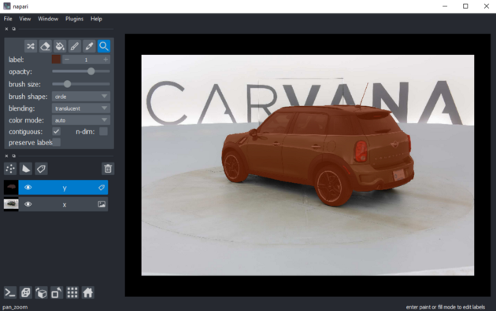
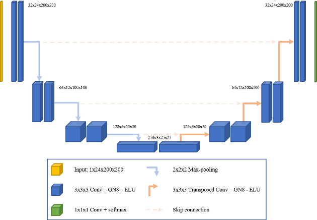

# PyTorch-2D-3D-UNet-Tutorial

**A beginner-friendly tutorial to start a 2D or 3D 
image segmentation deep learning project with [PyTorch](https://pytorch.org/) & the [U-Net architecture](https://arxiv.org/pdf/1505.04597.pdf)**. 
Based on the blog series 
["Creating and training a U-Net model with PyTorch for 2D & 3D semantic segmentation - A guide to semantic segmentation with PyTorch and the U-Net"](https://johschmidt42.medium.com/creating-and-training-a-u-net-model-with-pytorch-for-2d-3d-semantic-segmentation-dataset-fb1f7f80fe55).

## Installation

1. Set up a new environment with an environment manager (recommended):
   1. [conda](https://docs.conda.io/en/latest/miniconda.html):
      1. `conda create --name unet-tutorial -y`
      2. `conda activate unet-tutorial`
      3. `conda install python=3.8 -y`
   2. [venv](https://docs.python.org/3/library/venv.html):
      1. `python3 -m venv unet-tutorial`
      2. `source unet-tutorial/bin/activate`
2. Install the libraries:
`pip install -r requirements.txt`
3. Start a jupyter server:
`jupyter-notebook` OR `jupyter-lab`

**Note**: This will install the CPU-version of torch. If you want to use a GPU or TPU, please refer to the instructions on the [PyTorch website](https://pytorch.org/)

## Summary

- [Part I](https://towardsdatascience.com/creating-and-training-a-u-net-model-with-pytorch-for-2d-3d-semantic-segmentation-dataset-fb1f7f80fe55): Building a dataset in PyTorch & visualizing it with [napari](https://napari.org/)
- [Part II](https://towardsdatascience.com/creating-and-training-a-u-net-model-with-pytorch-for-2d-3d-semantic-segmentation-model-building-6ab09d6a0862): Creating the U-Net model in PyTorch & information about model input and output
- [Part III](https://towardsdatascience.com/creating-and-training-a-u-net-model-with-pytorch-for-2d-3d-semantic-segmentation-training-3-4-8242d31de234): Training a 2D U-Net model on a sample of the [Carvana](Carvana) dataset with improving datasets (caching, multiprocessing)
- [Part IV](https://towardsdatascience.com/creating-and-training-a-u-net-model-with-pytorch-for-2d-3d-semantic-segmentation-inference-4-4-e52b074ddf6f): Running inference on test data 
- Part V: Building a 3D dataset
- Part VI: Running an experiment with the experiment tracker [neptune.ai](https://neptune.ai/) and the high-level PyTorch library [PyTorch Ligthning](https://www.pytorchlightning.ai/) 

**Note**: Due to updates in the neptune API, part VI will probably not work and needs to be migrated to the [new neptune API](https://docs.neptune.ai/links/migration-guide) first

## Dataset samples

This repository contains a sample of a [2D](Carvana) and a [3D](Microtubules3D) dataset for semantic segmentation.

- 2D: [Carvana challenge](https://www.kaggle.com/c/carvana-image-masking-challenge)
- 3D: [Electron tomograms](https://en.wikipedia.org/wiki/Electron_tomography) showing [Microtubules](https://en.wikipedia.org/wiki/Microtubule) from [trypanosomes](https://en.wikipedia.org/wiki/Trypanosoma)

## U-Net model

If you are unsure what arguments to pass in the `Unet` class, 
please take a look at the [enums](https://docs.python.org/3/library/enum.html) in [unet.py](unet.py) and view examples in [test_unet.py](tests/test_unet.py).

**Note**: Weights are initialized randomly (xavier initialization) and training can take some time. 
To faster train a segmentation model, it is recommended to use a pretrained backbone such as [ResNet](https://pytorch.org/hub/pytorch_vision_resnet/) for 2D or even 3D tasks.
